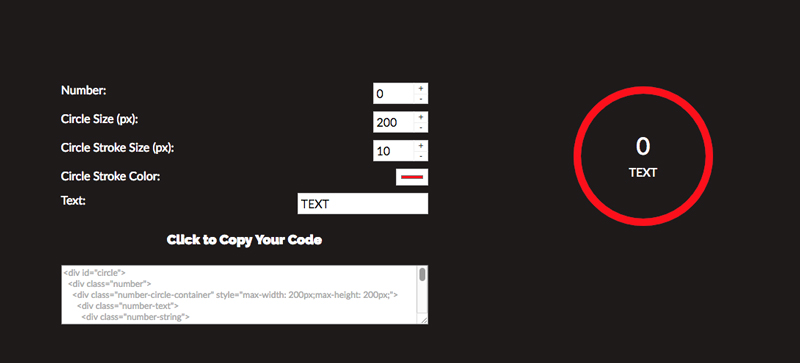

# SVGProgressCircle
Simple SVG + jQuery for animating progress using [Waypoints](https://github.com/imakewebthings/waypoints) to trigger the animation on an element when you scroll to it.

## About

The motivation behind this script was to have a way of animating SVG circles, which I was using on our agency's portfolio to visualize clients' improvements (e.g. **"+25% conversion rate"**), like so:


## Dependencies

* [jQuery 1.11.x+](http://jquery.com/)

## Demo

* [Demo](http://ryanmiller.us/projects/SVGProgressCircle)

## Usage

Add the stylesheet to the page:

```html
<link rel="stylesheet" href="SVGProgressCircle/SVGProgressCircle.css">
```

Add the following libraries to the page:

* jQuery
* SVGProgressCircle.js

```html
<script src="jquery.min.js"></script>
<script src="SVGProgressCircle/SVGProgressCircle.js"></script>
```

If you're already using Waypoints in your build, you can include the library without Waypoints:

```html
<script src="SVGProgressCircle/nowaypoints.SVGProgressCircle.js"></script>
```

## Initialization

Include the following HTML and SVG wrapped inside the element you want to initialize (e.g. `<div id="circle">...</div>`):

```html
<div class="number">
	<div class="number-circle-container">
		<div class="number-text">
			<div class="number-string">
				<span class="number-int">0</span>
			</div>
			<span class="number-after-text">Degrees Fahrenheit</span>
		</div>
		<div class="svg-container">											
			<svg class="svg" viewBox="0 0 200 200" version="1.1" preserveAspectRatio="xMinYMin meet">
				<circle class="bar-bg" r="90" cx="100" cy="100" fill="transparent" stroke-dasharray="565.49" stroke-dashoffset="0"></circle>
				<circle class="bar" r="90" cx="100" cy="100" fill="transparent" stroke-dasharray="565.49" stroke-dashoffset="565.49" transform="rotate(-90 100 100)" stroke="#9FEE00" style="stroke-dashoffset: 565.49;"></circle>
			</svg>
		</div>
	</div>
</div>
```

To initialize, call progressCircle on the element:

```js
	$('#circle').progressCircle();
```

## Options

| Option | Type | Defaults | Description |
| --- | --- | --- | --- |
| `number` | number | `0` | The number for the circle to animate to |
| `min` | number | `0` | The starting point for the circle to animate from |
| `max` | number | `100` | The maximum value the circle can animate to (must be greater than or equal to the `number` value |
| `speed` | number | `2000` | The speed, in milliseconds, it takes for the circle to complete its animation once initialized |
| `delay` | number | `0` | The delay, in milliseconds, of the circle's animation |
| `prefix` | string | `''` | A string (such as `'$'`) to be prepended to the circle's text |
| `suffix` | string | `''` | A string (such as `'$'`) to be appended to the circle's text |
| `offset` | number/string | `'80%'` | When to trigger the animation (see [Waypoints API](http://imakewebthings.com/waypoints/api/offset-option/)) |
| `loop` | boolean | `false` | Infinitely loops the circle animation |
| `format` | object |  |  |
| `format.decimal` | string | `'.'` | The format for decimal points within the circle's text |
| `format.thousands_sep` | string | `','` | The format for separating thousands within the circle's text |
| `onInit` | function | `null` | Callback function to call once the circle animation is initialized |
| `onComplete` | function | `null` | Callback function to call after the circle animation has completed |

## Build Your SVG Circle

If you're unfamiliar with SVG, you can use my ["Create Your Own Circle" tool](http://ryanmiller.us/projects/SVGProgressCircle/create-your-circle/):

